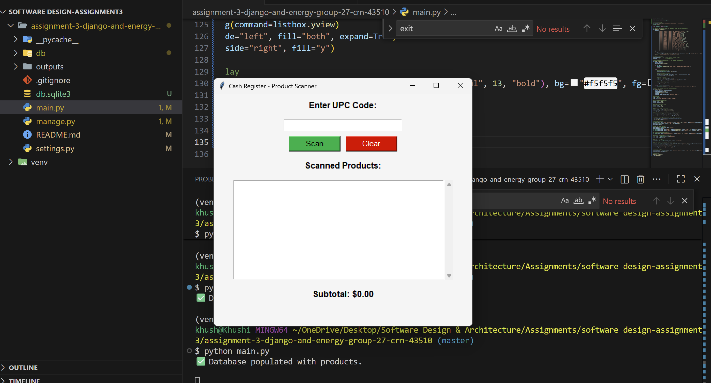
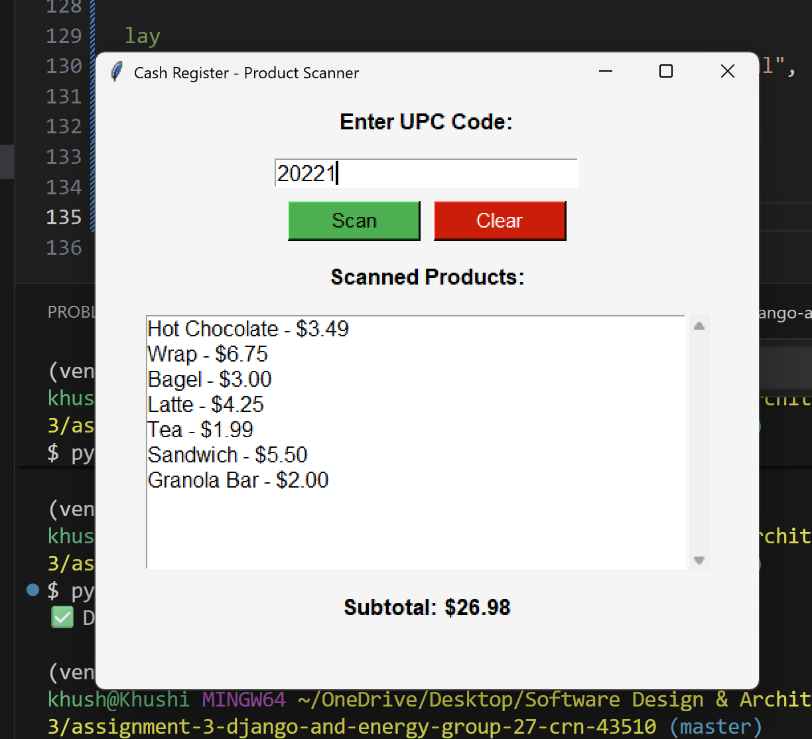
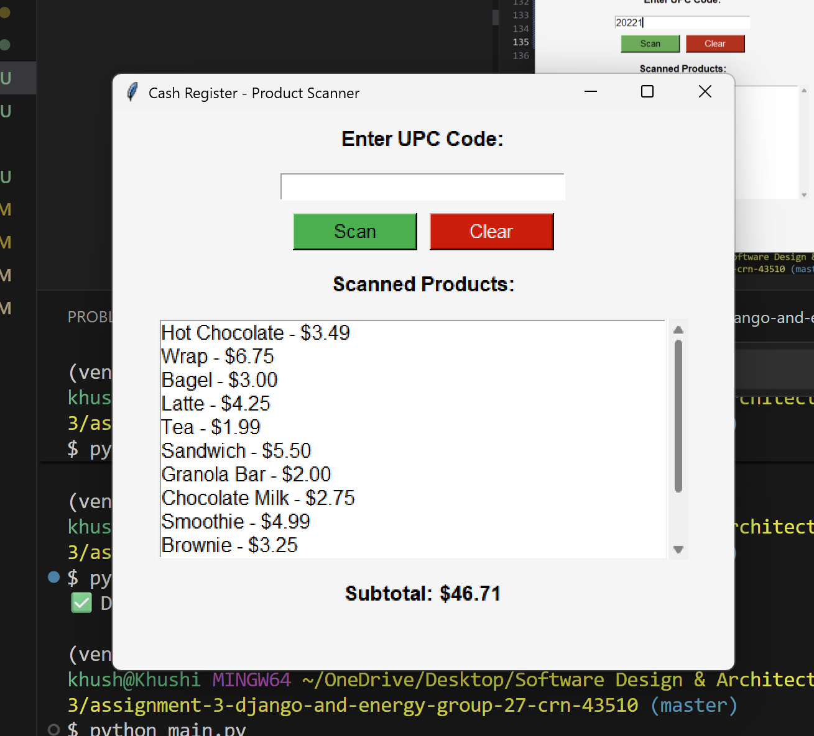
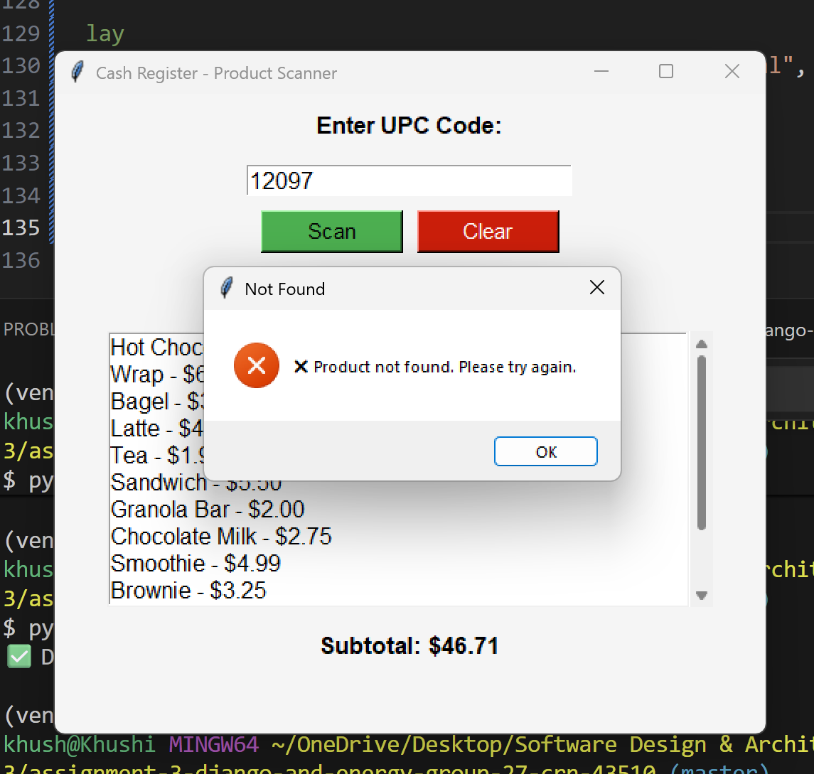

# 🧾 Cash Register Application (Django ORM + Tkinter) 
*Group 27*

This project is a **standalone cash register system** built using **Python**, **Django ORM**, and **Tkinter**.  
It replicates the basic functionalities of a store checkout system, allowing users to:
- Populate a product database with UPC codes, names, and prices.
- Scan products via a UPC input field.
- Display scanned products dynamically in a scrollable list.
- Automatically calculate and display a running subtotal.

This project leverages **Django’s ORM** for data handling and **Tkinter** for the GUI interface.

## 📁 Repository Structure
```
assignment-3-django-and-energy-group-27-crn-43510
|
├── 📁 __pycache__/
├── 📁 db/ 
│ ├── init.py
│ ├── models.py 
│ ├── 📁 migrations/ 
|
├── .gitignore
├── main.py 
├── manage.py 
├── settings.py 
├── db.sqlite3 
├── 📁 venv/
├── 📁 Outputs
└── README.md
```

## ⚙️ Setup & Execution

1. Clone the Repo:
```
git clone assignment-3-django-and-energy-group-27-crn-43510
cd assignment-3-django-and-energy-group-27-crn-43510
```

2. Activate the virtual environment
```
python -m venv venv
venv\Scripts\activate     # On Windows
source venv/bin/activate  # On Mac/Linux
```

3. Install Django
```
pip install django
```

4. Initialize the database
```
python manage.py makemigrations db 
python manage.py migrate
``` 
5. Run the project
```
python main.py
```
- When launched, the Tkinter window will appear centered on screen.
- Enter a UPC code and click Scan to add a product to the list.
- Use Clear to reset the display or Exit to close the program.

## 🎯 How Django ORM Is Used

The file `models.py` defines a Product model with three fields:
```
class Product(models.Model):
    upc = models.CharField(max_length=20, unique=True)
    name = models.CharField(max_length=100)
    price = models.DecimalField(max_digits=10, decimal_places=2)
```

The ORM automatically creates and manages a **SQLite database (`db.sqlite3`).**

In `main.py`, the app initializes Django’s environment:
```
os.environ.setdefault("DJANGO_SETTINGS_MODULE", "settings")
django.setup()
```
This connects the Tkinter frontend to the ORM backend seamlessly.

Products are populated using:
```
Product.objects.get_or_create(upc=p["upc"], defaults={"name": p["name"], "price": p["price"]})
```

All product lookups during scanning use:
```
Product.objects.get(upc=upc)
```

This satisfies the requirement to use Django’s **Object Relational Mapper (ORM)** for database operations.

## 🖥️ Application Features
- Graphical Interface built with Tkinter.
- UPC Input field for scanning products.
- Scrollable Listbox showing all scanned products.
- Subtotal Display updated in real time.
- Clear Button to reset list and subtotal.
- Exit Button to close the application.

## 📷 Demonstration
<table>
  <tr>
    <td></td>
    <td></td>
  </tr>
  <tr>
    <td></td>
    <td></td>
  </tr>
</table>

## 🧰 Tech Stack
- Python 3.x
- Django ORM
- Tkinter GUI
- SQLite3 Database

## 👥 Contribution Matrix
**Group 27**
| Team Member | Student ID | Role / Responsibility |
|---|---|---|
| **Khushi Patel** | 100940709 | Q1 - Django ORM |
| **Prabhnoor Saini** | 100946515 | Q1 - Django ORM |
| **Hadia Ali** | 100876605 | Q2 - Energy QA |

## 📜 License
*This project was created as part of a university coursework assignment for educational purposes only.*


